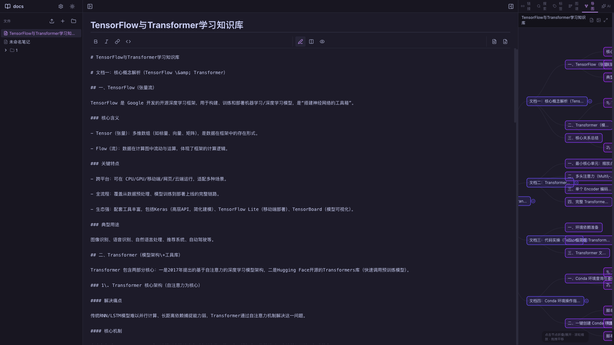

# MyObsidian

> 一款现代化的开源 Markdown 知识库管理工具，灵感来源于 Obsidian。基于 Electron、React 和 TypeScript 构建。


[English](README.md) | 简体中文

## 功能特性

- **Markdown 编辑** - 功能完整的 Markdown 编辑器，支持实时预览
- **知识图谱** - 通过交互式力导向图可视化笔记之间的关联
- **思维导图** - 从笔记标题层级自动生成思维导图，支持节点折叠
- **AI 辅助** - AI 辅助写作（续写、扩写、语法检查、摘要、格式修改），支持配置 Ollama
- **本地文件存储** - 所有笔记以 `.md` 文件形式存储在本地，完全可移植、可编辑
- **双向链接** - 使用 `[[wikilink]]` 语法创建笔记之间的关联
- **反向链接面板** - 查看哪些笔记引用了当前笔记
- **标签系统** - 使用 `#标签` 组织笔记，快速筛选
- **文件浏览器** - 通过文件夹树浏览和管理知识库
- **深色/浅色主题** - 切换主题，舒适编辑
- **导出功能** - 将笔记导出为 Markdown 文件

## 截图

> 

## 快速开始

### 前置要求

- [Node.js](https://nodejs.org/) >= 18
- [npm](https://www.npmjs.com/) >= 9

### 开发

```bash
# 克隆仓库
git clone https://github.com/zhaoliangcn/my-obsidian.git
cd my-obsidian

# 安装依赖
npm install

# 启动 Vite 开发服务器
npm run dev

# 启动 Electron 应用（Vite + Electron 同时运行）
npm run electron:start
```

### 构建

```bash
# 构建 Web 版本
npm run build

# 构建 Electron 桌面应用
npm run electron:build
```

### 一键构建运行

```bash
./scripts/build-and-run.sh
```

## 项目结构

```
my-obsidian/
├── electron/               # Electron 主进程
│   ├── main.ts             # 主进程入口
│   └── preload.ts          # 预加载脚本（IPC 桥接）
├── src/
│   ├── components/         # React 组件
│   │   ├── editor/         # Markdown 编辑器 & AI 面板
│   │   ├── explorer/       # 文件浏览器
│   │   ├── graph/          # 知识图谱 & 思维导图
│   │   ├── layout/         # 应用布局（侧边栏、面板）
│   │   ├── search/         # 搜索功能
│   │   └── tags/           # 标签面板
│   ├── store/              # Zustand 状态管理
│   ├── types/              # TypeScript 类型定义
│   ├── utils/              # 工具函数
│   │   ├── ai.ts           # AI/Ollama 集成
│   │   ├── filesystem.ts   # 文件系统操作（IPC）
│   │   ├── markdown.ts     # Markdown 解析
│   │   └── mindmap.ts      # 思维导图生成
│   └── App.tsx             # 主应用组件
├── scripts/
│   └── build-and-run.sh    # 一键构建运行脚本
├── package.json
├── vite.config.ts
└── tsconfig.json
```

## 技术栈

| 类别 | 技术 |
|------|------|
| 框架 | React 19 + TypeScript |
| 构建工具 | Vite 8 |
| 桌面应用 | Electron 39 |
| 状态管理 | Zustand 5 |
| Markdown | Marked 18 |
| 可视化 | D3.js 7 |
| 图标 | Lucide React |
| AI 集成 | Ollama（可配置） |

## 配置说明

### AI / Ollama

在应用设置中配置 Ollama 端点：

1. 打开 AI 面板（右侧边栏）
2. 点击设置图标
3. 设置 Ollama URL（默认：`http://localhost:11434`）
4. 选择你偏好的模型

### 知识库目录

首次启动时，系统会提示你选择一个文件夹作为知识库。所有笔记将以 `.md` 文件形式存储在该目录中。

## 开发路线

- [ ] 全文模糊搜索
- [ ] 画布 / 白板视图
- [ ] 插件系统
- [ ] 跨设备同步
- [ ] 移动端支持
- [ ] PDF 导出
- [ ] 模板系统
- [ ] Git 版本控制集成

## 贡献指南

欢迎贡献！请参阅 [CONTRIBUTING.md](CONTRIBUTING.md) 了解如何参与开发。

## 许可证

本项目采用 MIT 许可证 - 详见 [LICENSE](LICENSE) 文件。

## 致谢

- [Obsidian](https://obsidian.md/) - 知识管理概念的灵感来源
- [D3.js](https://d3js.org/) - 数据可视化库
- [Zustand](https://zustand-demo.pmnd.rs/) - 状态管理库
